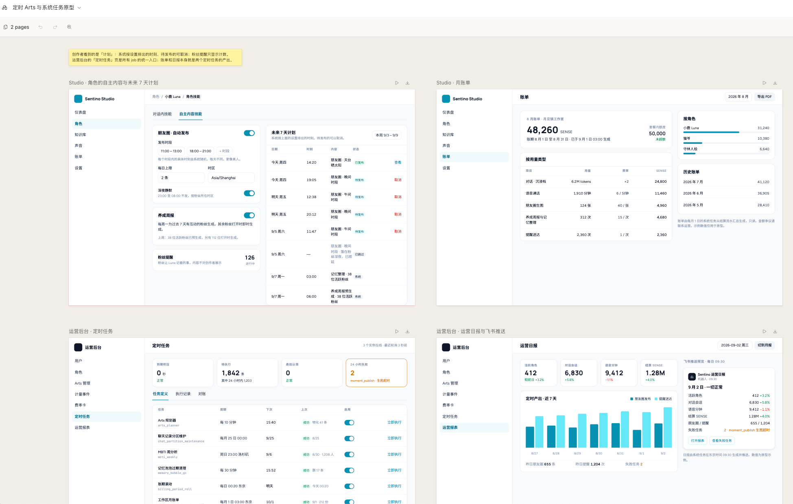
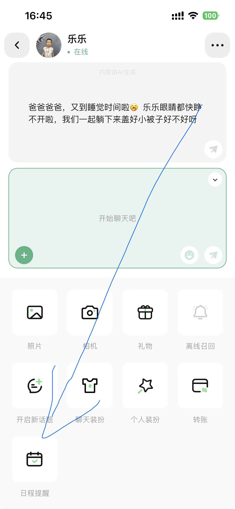
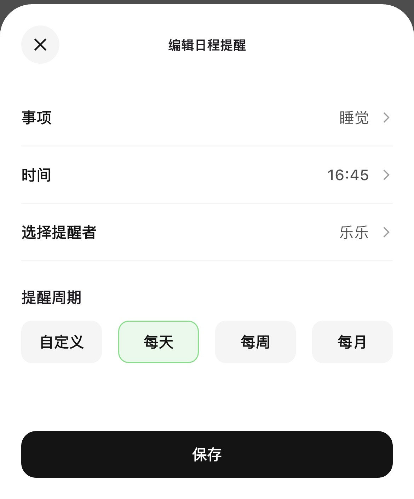
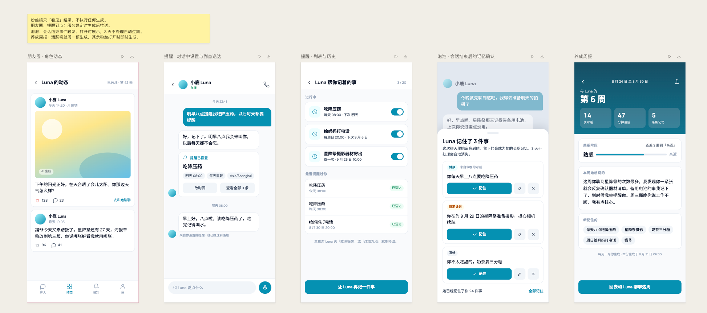

# 中央调度中心技术方案

> 基于 xxl-job 私有分支（sentino_0910）。本文回答两个问题：xxl-job 作为中央调度中心能解决哪些问题；数量随用户增长的个体定时任务如何用"分发器模式"落地。
>
> 版本：2026-09-10

---

## 1. 背景与设计原则

### 1.1 需求盘点

产品原型中所有与"时间"有关的功能，按内容分为四类。这个分类决定了每个需求由谁来做、怎么做。

**一、系统级周期任务**：数量固定，不随用户数增长，一条 cron 说清楚。

| 任务 | 周期 | 时区 |
|---|---|---|
| 聊天记录分区维护 | 每月 25 日 00:00 | 服务器默认 |
| MBTI 周分析 | 每周日 23:00 | America/Los_Angeles |
| 记忆泡泡过期清理 | 每 30 分钟 | 服务器默认 |
| 账单滚动 | 每日 00:20 | Asia/Tokyo |
| 工作区月账单 | 每月 1 日 03:00 | Asia/Tokyo |
| 运营日报生成并推送飞书 | 每日 09:30 | Asia/Tokyo |
| 养成周报（活跃粉丝预生成） | 每周一 06:00 | 服务器默认 |

**二、用户级个体定时任务**：每个用户或角色各有一份时间、周期、时区，数量随用户增长，且会被频繁修改和取消。

- 粉丝日程提醒：每天、每周、每月、自定义、仅一次，按用户时区到点送达。
- 角色朋友圈自动发布：每个角色在设定时段内随机抽时刻，每日上限，按粉丝时区深夜静默。
- 未来 7 天计划里的每一条待发布项，创作者可单条取消。

**三、事件或请求驱动的任务**：由用户行为触发，不由时间触发，不进调度中心。

- 泡泡生成：由"会话结束"事件触发，打开时展示。
- 养成周报的按需生成：非活跃粉丝打开页面时即时生成。
- 提醒的改期与取消：用户在聊天里说"改到九点""取消提醒"，是对提醒记录的写操作。

这一类里唯一和调度有关的是它们的"过期清理"，比如泡泡 3 天不处理自动消失，那是第一类里的一个 GC 任务。

**四、调度产出的数据视图**：不是任务，是读第一、二类任务写下的结果。

- 月账单、运营日报内容、Studio 的未来 7 天计划、"Luna 帮你记着的事"列表与已送达记录。

### 1.2 设计原则

1. **调度中心不承载业务逻辑。** xxl-job 只做触发、监控、告警、扩容。它不知道提醒表长什么样，也不知道朋友圈是什么。
2. **业务表是唯一真相源。** 任何用户可见的"计划"（提醒列表、未来 7 天计划）都直接读业务表，而不是读调度中心。
3. **调度中心里的任务数量与用户数无关。** 用户量翻十倍，xxl-job 里的任务表行数不变。
4. **只保留 BEAN 模式。** 所有任务都是执行器里的 Java Handler，不在线编辑脚本。

---

## 2. 分流决策

### 2.1 分流表

| 需求类型 | 处理方式 | 说明 |
|---|---|---|
| 一、系统级周期任务 | 直接建 xxl-job 任务 | 每个任务一条 xxl_job_info 记录，配 cron 与时区 |
| 二、用户级个体任务 | 分发器模式 | xxl-job 只建一个"分发器"任务每分钟触发，逐条到点数据由业务表驱动 |
| 三、事件或请求驱动 | 不进调度中心 | 在业务服务内同步或异步完成 |
| 四、数据视图 | 只读表 | 读业务表或 xxl_job_log |

### 2.2 判断口径

遇到新需求时，按顺序问三个问题：

1. **任务数量是否随用户数增长？** 是，则一定走分发器；否则可以直接建任务。
2. **是否会被频繁修改或取消？** 是，则真相源必须在业务表，调度中心不能持有它的时间。
3. **精度要求是什么？** 分钟级用扫表；秒级再考虑第 6 章的延时队列。

### 2.3 一个反例：为什么不能"一条提醒建一个 xxl-job 任务"

xxl-job 有 OpenAPI 可以新建、更新、删除任务，技术上可以为每条提醒建一个任务。但这样做会导致：

- 调度线程每秒预读"未来 5 秒内到点"的任务，xxl_job_info 行数随用户增长，预读查询与控制台列表都会被用户数据淹没。
- 每次触发是一条 HTTP 调用加一条日志，1 万条提醒每天就是 1 万次 HTTP 与 1 万行日志，而实际业务只需要"每分钟查一次表"。
- 用户改一次时间、取消一次提醒，都要反向调用 OpenAPI 去改调度中心。调度中心变成了业务库的副本，两边一致性成为新问题。

---

## 3. xxl-job 解决的问题

### 3.1 系统级任务的建任务方式



上图运营后台"定时任务"页的每一行，都对应一条 xxl-job 任务。建任务时的关键参数：

| 参数 | 取值 | 说明 |
|---|---|---|
| 调度类型 | CRON / FIX_RATE / NONE | 周期任务用 CRON；每 N 秒用 FIX_RATE；只手动触发用 NONE |
| 时区 | 如 Asia/Tokyo | 本分支新增，仅 CRON 生效，为空用调度中心默认时区 |
| JobHandler | 执行器里 @XxlJob 注解的名字 | 必填，BEAN 模式唯一入口 |
| 任务参数 | 任意字符串，推荐 JSON | 执行器通过 XxlJobHelper.getJobParam() 取到 |
| 路由策略 | FIRST / ROUND / FAILOVER / SHARDING_BROADCAST 等 | 单实例执行选 FAILOVER；要并行处理大批数据选分片广播 |
| 阻塞处理策略 | SERIAL_EXECUTION / DISCARD_LATER / COVER_EARLY | 上一轮没跑完时怎么办，分发器类任务选 DISCARD_LATER |
| 调度过期策略 | DO_NOTHING / FIRE_ONCE_NOW | 调度中心停机后恢复，错过的那次要不要补跑一次 |
| 超时时间 / 失败重试 | 秒 / 次 | 对应原型里"生图超时"类失败的兜底 |

首批系统任务的建议配置见第 8.3 节。

### 3.2 停机与漏发的处理

调度线程每秒运行一次，预读未来 5 秒内到点的任务放入时间轮。恢复后遇到"已经过了触发时间"的任务分两种情况：

- 过期不足 5 秒：直接触发，然后算下一次。
- 过期超过 5 秒：按调度过期策略处理。DO_NOTHING 直接跳到下一次；FIRE_ONCE_NOW 立即补跑一次。

对系统任务的建议：账单、日报这类"每天必须出一份"的选 FIRE_ONCE_NOW；分发器、GC 这类"下一轮会覆盖"的选 DO_NOTHING。

### 3.3 高可用与可观测

- **调度中心多实例**：靠数据库锁保证同一时刻只有一个实例在调度，一次任务只触发一次。
- **执行器多实例**：自动注册到执行器组，路由策略决定打到哪台。FAILOVER 会在心跳失败时切到下一台。
- **执行记录**：每次触发一条 xxl_job_log，含调度结果、执行结果、耗时。
- **Rolling 日志**：执行器侧按日期与日志 ID 落文件，控制台在线滚动查看，保留天数可配。
- **失败告警**：JobAlarm 接口，现有邮件实现。飞书实现见第 7.2 节。

### 3.4 本分支的定制

**移除 GLUE，只留 BEAN。** GLUE 模式允许在控制台在线编辑 Groovy、Shell、Python 等脚本并下发执行。对纯调度中心而言，它把业务逻辑放进了调度中心，且在线执行任意脚本是明显的安全面。移除后：

- 执行器不再依赖 Groovy，包体积与启动时间下降。
- 触发协议里不再传源码，调度中心与执行器需一并升级。
- 所有任务的逻辑都在执行器代码里，走正常的代码评审与发布流程。

**任务级时区字段 `schedule_timezone`。** 原版 cron 按调度中心 JVM 默认时区解析。原型里同时存在"周日 23:00 洛杉矶"和"每日 00:20 东京"，换算到服务器时区会在夏令时切换时偏差一小时。新字段让每个 CRON 任务按自己的时区解析，为空则沿用默认。

### 3.5 边界：xxl-job 不做什么

- **不做一次性个体任务。** "9 月 25 日 10:00 提醒某个用户寄器材"这种带 payload 的一次性事件，不建 xxl-job 任务，走分发器。
- **不做延时消息。** 它没有"在时刻 T 投递一段数据给消费者"的语义，也不应该改造成这样，见第 6 章。
- **不做业务对账。** "该发的提醒有没有都发了"是业务投递日志的事，xxl-job 只能回答"分发器有没有每分钟跑"。

### 3.6 与运营后台的集成

两种方式，可以并存：

1. **直接使用 xxl-job 控制台。** 零开发，运营人员登录后即可看任务列表、执行记录、日志、报表。适合内部运维。
2. **通过 OpenAPI 自建页面。** 现有接口：新建、更新、删除、启动、停止、手动触发。适合把"定时任务"页嵌进统一的运营后台。执行记录目前没有 OpenAPI，需要直接读 xxl_job_log 表，或按需补一个查询接口。

---

## 4. 分发器模式最佳实践

### 4.1 核心思想

**xxl-job 每分钟敲一次钟，业务表决定敲钟之后做什么。**

xxl-job 里只有一个任务 `reminder_dispatcher`，CRON 设为每分钟一次，JobHandler 指向业务执行器里的一个 Bean。它每分钟查一次业务表，把到点的提醒逐条处理。用户在 App 里保存、修改、取消提醒，只改业务表，整个过程不碰 xxl-job。

### 4.2 提醒表设计





编辑页的四个字段直接映射到表结构。

```sql
CREATE TABLE reminder (
    id              BIGINT       NOT NULL AUTO_INCREMENT,
    user_id         BIGINT       NOT NULL                COMMENT '设置提醒的用户',
    character_id    BIGINT       NOT NULL                COMMENT '提醒者，对应"选择提醒者"',
    title           VARCHAR(128) NOT NULL                COMMENT '事项，如"睡觉"',
    rule_type       VARCHAR(16)  NOT NULL                COMMENT 'ONCE / DAILY / WEEKLY / MONTHLY / CUSTOM',
    rule_conf       VARCHAR(128) DEFAULT NULL            COMMENT 'WEEKLY 存周几，MONTHLY 存几号，CUSTOM 存 cron',
    local_time      TIME         NOT NULL                COMMENT '用户本地时刻，如 16:45',
    timezone        VARCHAR(64)  NOT NULL                COMMENT '用户时区，如 Asia/Shanghai',
    next_fire_at    DATETIME     DEFAULT NULL            COMMENT '下一次触发时刻，UTC',
    status          TINYINT      NOT NULL DEFAULT 1      COMMENT '1 进行中 2 已暂停 3 已结束',
    claim_token     VARCHAR(64)  DEFAULT NULL            COMMENT '抢占标记，处理中的实例写入',
    version         INT          NOT NULL DEFAULT 0      COMMENT '每次改期或取消加一',
    add_time        DATETIME     NOT NULL,
    update_time     DATETIME     NOT NULL,
    PRIMARY KEY (id),
    KEY idx_due (status, next_fire_at),
    KEY idx_user (user_id, status)
) ENGINE = InnoDB DEFAULT CHARSET = utf8mb4;

CREATE TABLE reminder_delivery (
    id              BIGINT       NOT NULL AUTO_INCREMENT,
    reminder_id     BIGINT       NOT NULL,
    fire_at         DATETIME     NOT NULL                COMMENT '计划触发时刻，UTC',
    delivered_at    DATETIME     DEFAULT NULL,
    result          TINYINT      NOT NULL                COMMENT '1 已送达 2 失败 3 错过',
    error_msg       VARCHAR(512) DEFAULT NULL,
    PRIMARY KEY (id),
    UNIQUE KEY uk_fire (reminder_id, fire_at)
) ENGINE = InnoDB DEFAULT CHARSET = utf8mb4;
```

要点：

- **next_fire_at 存 UTC。** 到点判断只比较时间戳，"每周日 20:00 洛杉矶"和"每天 08:00 上海"混在同一张表里没有问题。时区换算只发生在写入和重算 next_fire_at 时。
- **idx_due 是分发器唯一依赖的索引。** 每分钟的查询走这个索引，扫描行数等于本分钟到点的行数。
- **reminder_delivery 的唯一键保证幂等。** 同一条提醒的同一次触发只会有一条投递记录，重复处理会被唯一键拦住。
- **version 用于竞态兜底。** 分发器查出行后到真正投递之间，用户可能改了时间，投递前比对 version。

### 4.3 分发五步

```
每分钟一次，由 xxl-job 触发：

1. 查到点行
   SELECT * FROM reminder
   WHERE status = 1 AND next_fire_at <= UTC_TIMESTAMP()
     AND MOD(id, :shardTotal) = :shardIndex
   ORDER BY next_fire_at LIMIT 500

2. 抢占
   UPDATE reminder SET claim_token = :token
   WHERE id = :id AND status = 1 AND claim_token IS NULL AND version = :version
   影响行数为 0 则跳过这条，说明被别的实例抢走或用户刚改过

3. 投递
   调角色服务生成提醒话术，推送给用户
   INSERT reminder_delivery (reminder_id, fire_at, result)

4. 重算下一次
   ONCE：status = 3
   DAILY / WEEKLY / MONTHLY / CUSTOM：按 rule_type、local_time、timezone 算下一个 UTC 时刻写入 next_fire_at
   同时 claim_token = NULL

5. 记录
   处理条数、失败条数写入 xxl-job 日志，供控制台与运营日报查看
```

### 4.4 必须处理的问题

**幂等与并发**

- xxl-job 侧：分发器任务的阻塞策略选 DISCARD_LATER。上一分钟没跑完时，这一分钟的触发直接丢弃，避免两轮重叠。
- 业务侧：第 2 步的 UPDATE 抢占加 reminder_delivery 唯一键，即便重叠也不会重复推送。

**停机追赶与最大迟到**

调度中心或执行器停了 10 分钟，恢复后第一轮会查出 10 分钟内所有到点的提醒。策略由业务定：

- "睡觉提醒"迟到 10 分钟仍然要发。
- 迟到超过阈值（建议 30 分钟）的，写 reminder_delivery 为"错过"，不再推送，但仍然重算下一次。

这个阈值放在分发器配置里，不同类型的个体任务可以不同。

**分片广播扩容**

提醒量大时，把分发器的路由策略改为 SHARDING_BROADCAST。xxl-job 会同时触发所有执行器实例，并把分片序号与总数传给每个实例。第 1 步的 `MOD(id, shardTotal) = shardIndex` 让每台机器只处理自己的那份。加机器就是加吞吐，代码不变。

**时区与夏令时**

- 重算 next_fire_at 时用 `ZonedDateTime.of(localDate.plusDays(1), local_time, zone).toInstant()`，而不是在 UTC 上加 24 小时。夏令时切换那天两者相差一小时。
- 用户改了 App 时区设置，业务侧更新 timezone 并重算 next_fire_at。

**仅一次任务的收尾**

ONCE 类型投递后直接 status = 3。产品页"最近提醒过你"读 reminder_delivery，不依赖 reminder 表还留着这一行。

### 4.5 抽象层：AbstractDueItemJobHandler

提醒、朋友圈发布、泡泡 GC 三个场景的骨架一模一样：查到点行、抢占、逐条处理、重算或标记结束。把骨架做成模板，业务只实现五个方法。模板放在执行器 SDK 层或业务公共包，**不放进调度中心**。

```java
public abstract class AbstractDueItemJobHandler<T> extends IJobHandler {

    /** 查出本分片到点的数据，limit 为单轮上限 */
    protected abstract List<T> fetchDue(Instant now, int shardIndex, int shardTotal, int limit);

    /** 抢占，返回 false 表示被别的实例抢走或数据已变化 */
    protected abstract boolean claim(T item);

    /** 真正的业务动作 */
    protected abstract void process(T item) throws Exception;

    /** 重算下一次或标记结束，同时释放抢占 */
    protected abstract void reschedule(T item);

    /** 单条失败的处理，比如写失败日志、决定是否重试 */
    protected abstract void onFailure(T item, Exception e);

    /** 迟到超过该值的数据按"错过"处理，默认 30 分钟 */
    protected Duration maxLateness() { return Duration.ofMinutes(30); }

    protected int batchLimit() { return 500; }

    @Override
    public void execute() throws Exception {
        Instant now = Instant.now();
        int shardIndex = XxlJobHelper.getShardIndex();
        int shardTotal = XxlJobHelper.getShardTotal();

        List<T> items = fetchDue(now, shardIndex, shardTotal, batchLimit());
        int success = 0, failed = 0, skipped = 0;

        for (T item : items) {
            if (!claim(item)) { skipped++; continue; }
            try {
                process(item);
                success++;
            } catch (Exception e) {
                failed++;
                onFailure(item, e);
            } finally {
                reschedule(item);
            }
        }

        XxlJobHelper.log("due={}, success={}, failed={}, skipped={}, shard={}/{}",
                items.size(), success, failed, skipped, shardIndex, shardTotal);
        if (failed > 0) {
            XxlJobHelper.handleFail("failed=" + failed);
        }
    }
}
```

模板统一负责的部分正是每个业务都容易写错的部分：分片切分、抢占防重、单条失败不影响整批、迟到策略、把处理条数写进 xxl-job 日志。

先用提醒场景把模板写出来跑通，第二个场景接入时再修正接口。不要在只有一个用例时就设计得很通用。

### 4.6 逐场景套用



| 场景 | xxl-job 任务 | 业务表 | 分发器做的事 |
|---|---|---|---|
| 粉丝日程提醒 | reminder_dispatcher，每分钟 | reminder | 4.3 节的五步 |
| 朋友圈自动发布 | moment_publisher，每 10 分钟 | moment_plan | 取出到点且未取消的计划行，生成并发布。计划行本身由 Studio 业务侧在创作者保存设置时按时段、每日上限、深夜静默排出，调度中心不参与 |
| 深夜静默 | 无 | moment_plan | Studio 排计划时按粉丝时区跳过 23:00 到 08:00，属于业务逻辑 |
| 未来 7 天计划 | 无 | moment_plan | Studio 直接读表，取消只改 status |
| 泡泡过期 | bubble_gc，每 30 分钟 | memory_bubble | 删除 created_at 超过 3 天且未处理的行 |
| 养成周报预生成 | weekly_report，每周一 06:00，分片广播 | weekly_report | 对上周有互动的粉丝分片生成；其他粉丝打开时即时生成，不经调度 |

朋友圈场景值得单独说明：调度中心里只有发布器这**一个**任务。"在时段内随机抽时刻、每日上限、深夜静默"是 Studio 的业务规则，在创作者保存设置时就把未来 7 天的计划行排进 moment_plan 表，创作者因此能提前看到并单条取消。发布器只关心"哪些行到点了"，不知道这些行是怎么来的。

---

## 5. 事件驱动任务的处理

### 5.1 不进调度中心的任务

- **泡泡生成**：会话结束事件在业务服务内触发，同步或投消息队列异步生成，写 memory_bubble 表。
- **按需周报**：非活跃粉丝打开页面时，业务接口现场生成并缓存。
- **提醒改期与取消**：聊天里识别到意图后，更新 reminder 表的 local_time、rule_type 或 status，重算 next_fire_at，version 加一。

这三类都不需要知道 xxl-job 的存在。

### 5.2 为什么不用 xxl-job 的手动触发接口来做事件驱动

OpenAPI 有 triggerJob 可以立即触发一次任务，理论上可以在会话结束时调它。但这样做只是多了一跳网络与一条无意义的调度日志，业务服务直接调自己的方法更简单。调度中心的价值在"按时间触发"，事件驱动不需要它。

---

## 6. 演进路线：从扫表到延时队列

### 6.1 什么信号说明扫表该换了

- 需要秒级精度，分钟一跳不够。
- 待触发行太多，每分钟按 idx_due 扫描已成为数据库负担。
- 不想让一个每分钟必跑的任务成为单点。

当前日投递千级、分钟精度，扫表完全够用。出现上述信号之前不要动。

### 6.2 RocketMQ 定时消息与 Redis ZSET 的对比

| 维度 | RocketMQ 定时消息 | Redis ZSET |
|---|---|---|
| 最长延时 | 4.x 只有 18 个固定档位，最长 2 小时；5.x 任意时刻，默认上限 3 天 | 任意，score 就是时间戳 |
| 取消 / 改时间 | 没有撤回 API，只能消费时查库判断 | ZREM、ZADD 一条命令 |
| 周期任务 | 消费时再发一条下一次的消息 | 处理完 ZADD 下一次 |
| 精度 | 秒级 | 秒级，取决于轮询间隔 |
| 可靠性 | 刷盘、重试、死信现成 | 靠 AOF，重试和死信自己写 |
| 要写的代码 | 生产者加消费者 | 一个轮询器，Lua 原子弹出，几十行 |
| 运维成本 | 没有 RocketMQ 要新增集群 | Redis 通常已有 |

**结论：选 Redis ZSET。** 原因是改期取消非常频繁、延时可能长达一个月、量不大。RocketMQ 定时消息适合"发出去就不会改、延时几小时内、绝不能丢"的场景，比如订单超时关单。

### 6.3 混合结构

DB 仍是真相源，Redis 只是近期索引。

1. 业务写提醒时同时写 DB 和 ZADD，member 是 reminder id，score 是 next_fire_at 的 UTC 时间戳。
2. 轮询器每秒执行一段 Lua：`ZRANGEBYSCORE key 0 now LIMIT 0 100` 然后 `ZREM`，原子完成，多实例并跑不会重复。
3. 弹出后**回查 DB**，确认该提醒 status 仍为进行中且 next_fire_at 与弹出的 score 一致，再投递。这一步兜住所有取消与改期的竞态。
4. 投递后重算下一次，写 DB 并 ZADD。
5. xxl-job 保留 `reminder_reconcile` 每小时任务做对账：把 DB 里未来 2 小时内到点但 ZSET 里缺失的提醒补进去，防 Redis 丢数据。

这样 xxl-job 从"每分钟的心跳"退到"每小时的兜底"，秒级精度和取消改期交给 Redis，数据可靠性仍由 DB 保证。

### 6.4 迁移只替换 fetchDue

用了第 4.5 节的模板之后，迁移到 ZSET 只需要把 `fetchDue` 的实现从"查 idx_due"换成"Lua 弹出加回查 DB"。claim、process、reschedule、onFailure 一行不动。这是提前抽象的直接收益。

---

## 7. 可观测与运维

### 7.1 两层监控

| 层 | 数据源 | 回答的问题 | 使用者 |
|---|---|---|---|
| 调度层 | xxl_job_log、执行器 Rolling 日志 | 分发器有没有每分钟跑、跑了多久、失败几次 | 运维、运营后台"定时任务"页 |
| 业务层 | reminder_delivery、moment_plan 状态 | 某条提醒有没有送到、哪条朋友圈没发出去 | 产品页"已送达"、客服 |

两层不能互相替代。xxl-job 日志里"分发器成功"只说明这一轮跑完了，不说明每条都送达；业务表里"已送达"也不能说明分发器是否漏跑了一轮。

### 7.2 失败告警

现有 JobAlarm 接口只有邮件实现。补一个飞书 webhook 实现，接口只有一个方法：

```java
public interface JobAlarm {
    boolean doAlarm(XxlJobInfo info, XxlJobLog jobLog);
}
```

实现类读任务的 alarm_email 字段作为飞书群 webhook 地址或群 ID，注册为 Spring Bean 即被 JobAlarmer 自动收集。告警内容带任务名、执行器地址、失败原因、日志链接。

### 7.3 运营日报的数据来源

原型运营日报中"失败任务 2 · moment_publish · 生图超时"这一项，直接查 xxl_job_log 中 handle_code 非 200 的记录按任务分组。"昨日提醒 1,204 次"查 reminder_delivery。日报本身是第一类系统任务，每日 09:30 东京时间触发。

---

## 8. 落地清单

### 8.1 调度中心

**数据库迁移**（已有库执行，新库直接用 doc/db/tables_xxl_job.sql）：

```sql
ALTER TABLE xxl_job_info
    ADD COLUMN schedule_timezone VARCHAR(64) DEFAULT NULL
        COMMENT '调度时区，CRON类型生效，为空则使用调度中心默认时区' AFTER schedule_conf,
    DROP COLUMN glue_type,
    DROP COLUMN glue_source,
    DROP COLUMN glue_remark,
    DROP COLUMN glue_updatetime;
DROP TABLE IF EXISTS xxl_job_logglue;
```

**部署拓扑**：调度中心 2 实例共享一个 PostgreSQL（本分支已从 MySQL 移植），靠 xxl_job_lock 表互斥。执行器按业务域分组，每组至少 2 实例。调度中心与执行器之间用执行器维度的 AccessToken。

### 8.2 执行器

- **通用 HTTP 回调 Handler**：保留示例工程中的 httpJobHandler。业务服务只需暴露一个接口，任务参数里写 URL 与请求体，不必每个任务写 Java 代码。适合第一类任务中逻辑已在业务服务内的场景。
- **分发器模板**：第 4.5 节的 AbstractDueItemJobHandler。
- **首个分发器**：ReminderDispatcherJobHandler，继承模板，实现五个方法。

### 8.3 首批任务清单

| 任务名 | JobHandler | 调度类型 | Cron | 时区 | 路由 | 阻塞 | 过期策略 |
|---|---|---|---|---|---|---|---|
| 提醒分发器 | reminderDispatcher | CRON | `0 * * * * ?` | 默认 | FAILOVER，量大改分片广播 | DISCARD_LATER | DO_NOTHING |
| 朋友圈发布器 | momentPublisher | CRON | `0 */10 * * * ?` | 默认 | FAILOVER | DISCARD_LATER | DO_NOTHING |
| 泡泡 GC | bubbleGc | CRON | `0 */30 * * * ?` | 默认 | FAILOVER | DISCARD_LATER | DO_NOTHING |
| 聊天记录分区维护 | chatPartitionMaintenance | CRON | `0 0 0 25 * ?` | 默认 | FAILOVER | SERIAL_EXECUTION | FIRE_ONCE_NOW |
| MBTI 周分析 | mbtiWeekly | CRON | `0 0 23 ? * SUN` | America/Los_Angeles | FAILOVER | SERIAL_EXECUTION | FIRE_ONCE_NOW |
| 账单滚动 | billingPeriodRoll | CRON | `0 20 0 * * ?` | Asia/Tokyo | FAILOVER | SERIAL_EXECUTION | FIRE_ONCE_NOW |
| 工作区月账单 | workspaceMonthlyBill | CRON | `0 0 3 1 * ?` | Asia/Tokyo | FAILOVER | SERIAL_EXECUTION | FIRE_ONCE_NOW |
| 运营日报 | opsDailyReport | CRON | `0 30 9 * * ?` | Asia/Tokyo | FAILOVER | SERIAL_EXECUTION | FIRE_ONCE_NOW |
| 养成周报预生成 | weeklyReportPregen | CRON | `0 0 6 ? * MON` | 默认 | SHARDING_BROADCAST | SERIAL_EXECUTION | FIRE_ONCE_NOW |

### 8.4 分阶段计划

**阶段一：跑通**

- 部署调度中心与一个业务执行器，建第 8.3 节的系统任务。
- 直接实现 ReminderDispatcherJobHandler，不抽象，验证提醒表设计与五步流程。

**阶段二：抽象**

- 从 ReminderDispatcher 提炼 AbstractDueItemJobHandler。
- 朋友圈发布器与泡泡 GC 接入模板，修正接口。
- 补飞书 JobAlarm。

**阶段三：按需演进**

- 出现第 6.1 节的信号时，引入 Redis ZSET，替换 fetchDue，增加对账任务。
- 如运营后台需要执行记录，补一个 OpenAPI 查询接口。

---

## 附录

### A. 迁移 SQL

见第 8.1 节。

### B. 提醒表 DDL

见第 4.2 节。

### C. 分片与抢占 SQL

```sql
-- 查到点行，按分片
SELECT id, user_id, character_id, title, rule_type, rule_conf, local_time, timezone, next_fire_at, version
FROM reminder
WHERE status = 1
  AND next_fire_at <= UTC_TIMESTAMP()
  AND MOD(id, :shardTotal) = :shardIndex
ORDER BY next_fire_at
LIMIT 500;

-- 抢占，影响行数为 0 表示跳过
UPDATE reminder
SET claim_token = :token, update_time = UTC_TIMESTAMP()
WHERE id = :id AND status = 1 AND claim_token IS NULL AND version = :version;

-- 投递记录，唯一键保证幂等
INSERT INTO reminder_delivery (reminder_id, fire_at, delivered_at, result)
VALUES (:id, :fireAt, UTC_TIMESTAMP(), 1);

-- 重算下一次并释放抢占
UPDATE reminder
SET next_fire_at = :nextFireAt, claim_token = NULL, update_time = UTC_TIMESTAMP()
WHERE id = :id;

-- 仅一次类型收尾
UPDATE reminder
SET status = 3, claim_token = NULL, update_time = UTC_TIMESTAMP()
WHERE id = :id;
```

### D. Redis ZSET 原子弹出 Lua

```lua
-- KEYS[1] = zset key, ARGV[1] = now (epoch seconds), ARGV[2] = limit
local items = redis.call('ZRANGEBYSCORE', KEYS[1], 0, ARGV[1], 'LIMIT', 0, ARGV[2])
if #items > 0 then
    redis.call('ZREM', KEYS[1], unpack(items))
end
return items
```

### E. 下一次触发时刻的计算示例

```java
static Instant nextDaily(LocalTime localTime, ZoneId zone, Instant after) {
    ZonedDateTime afterZoned = after.atZone(zone);
    ZonedDateTime candidate = afterZoned.toLocalDate().atTime(localTime).atZone(zone);
    if (!candidate.isAfter(afterZoned)) {
        candidate = afterZoned.toLocalDate().plusDays(1).atTime(localTime).atZone(zone);
    }
    return candidate.toInstant();
}
```

用本地日期加一天再套时区，而不是在 Instant 上加 24 小时，夏令时切换那天才不会偏差一小时。
